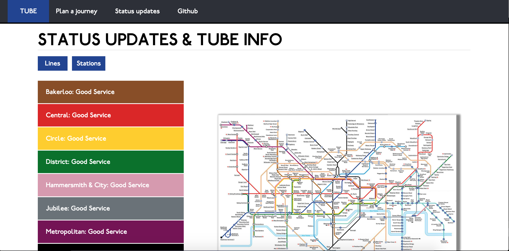
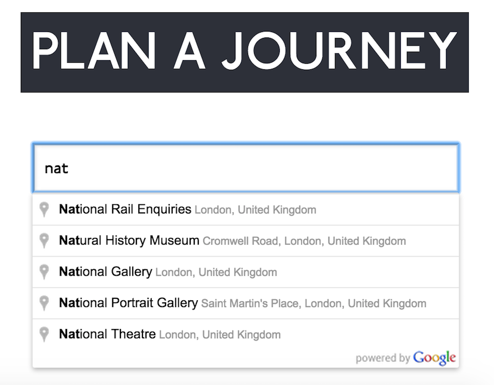
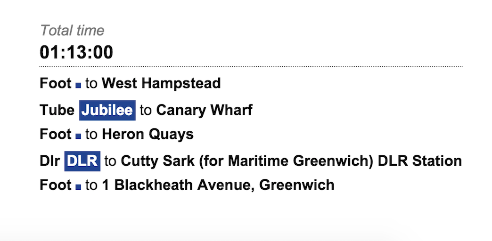

[](https://codeclimate.com/github/katebeavis/tube-api-app)
# Tube App
Tube app utilises the transport api in order to display the current status of London Underground lines. Users can click on a line to see what stations are on that particular line.

Users are also able to plan their journey by entering start and end points to their journey and getting a suggested public transport route in return. This feature uses the Google Places autocomplete api, from which I extracted the longitide and latitude coordinates before inserting them into a GET request.

It is a single page Angular app built on an express server which utilises partials to give the feel of a multi page website.

##Heroku & Screenshots
###[Tube App](https://kate-tubeapp.herokuapp.com)
Due to CORS issues with the api which couldn't be resolved by adding headers to the server, a Chrome plugin must be installed to run this app in the browser when being served remotely:
[CORS Extension](https://chrome.google.com/webstore/detail/allow-control-allow-origi/nlfbmbojpeacfghkpbjhddihlkkiljbi?hl=en)
<div align="center">
  
</div>
<div align="center">
  
  
</div>

##Technology
- Javascript
- AngularJS
- Node.js
- Express
- HTML & CSS
- Transport API
- Google Places autocomplete API
- Karma
- Protractor


##To Run
```
$ git clone https://github.com/katebeavis/tube-api-app.git
$ cd tube-api-app
$ npm install
$ bower install
$ npm start
visit http://localhost:3000
```

##To Run Tests
```
$ webdriver-manager start
$ karma start test/karma.conf.js (To run unit tests)
$ protractor test/conf.js (To run Protractor tests)
```
You must have the server running to run protractor tests
